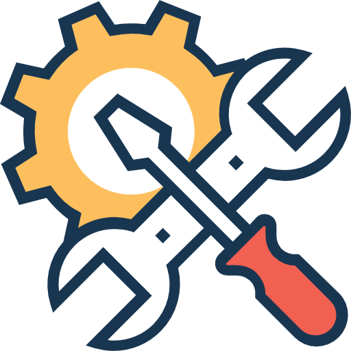

	<h1>Bloons TD Battles 2 Wiki</h1>
	 
	<strong>🎈 Let's get hacking 🎈</strong>
    
A repository of tools and information for modding Bloons TD Battles 2

# The Index

[***Click here to visit the current online version of the index.***](https://round8.github.io/BTDB2-Wiki/)

## About The Index

The BTDB2 Wiki is a community-maintained website created for the purpose of compiling resources, documenting file formats, and various other resources for Bloons TD Battles 2. 

The goal is to have a vast array of game knowledge all condensed into one area for easy reference and viewing.

## How to Contribute

- [Contributing to the Index: Online](./docs/guides/contributing-online.md)
- [Contributing to the Index: Locally](./docs/guides/contributing-locally.md)

## Contact Us

This repository is maintained by some of the folks from the [Rush Reborn](https://discord.gg/USpJnaaNap) Discord server. Saying hi in the `#mods` channel is the fastest way to get noticed.

## Credits, Attributions

- Header icon made by <a href="https://www.flaticon.com/authors/prosymbols" title="Prosymbols">Prosymbols</a> from <a href="https://www.flaticon.com/" title="Flaticon"> www.flaticon.com</a>