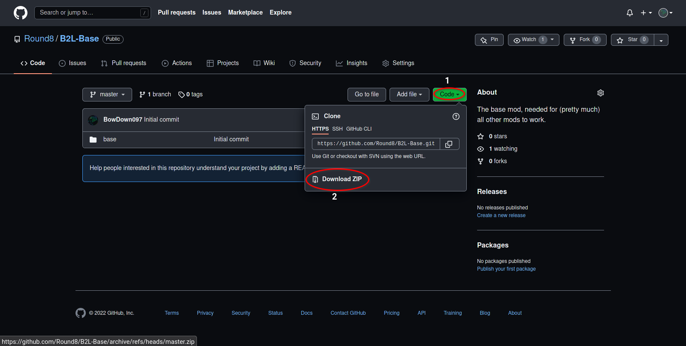

# The Mod Guide
Hello hello! This page will break down how to get mods up and running, by platform, so you can get toying with Battles 2.
Currently, the only supported platforms are Windows and Linux. Support will likely never come for any other platform.

## Windows
1. Download the mod API from [here](https://github.com/Round8/B2L-Releases/releases/download/v1.1.0/wininet.dll).
2. Throw the file into the Battles 2 folder. By default, it should be in `Program Files (x86)\Steam\steamapps\common\Bloons TD Battles 2`. If you installed Steam to another location, then you'll have to figure out the location yourself.
3. Create a folder named `mods` in the Battles 2 folder.
4. Download the base mod from [here](https://github.com/Round8/B2L-Base/releases/download/v1.1.0/base.zip) and extract it in the mods folder that you just created.
5. Download some mods! You can get them from the [Rush Reborn Discord server](https://discord.gg/USpJnaaNap). Make sure you extract them in the mods folder just like the base mod, otherwise they will not work.
6. Have fun!

## Linux
1. Follow steps 1-5 in the Windows guide.
2. Install `protontricks` if you haven't already. On Arch, for example, you can find it in the `protontricks` package in the AUR.
3. Launch the Protontricks GUI with the `protontricks --gui` command.
4. Select Battles 2, then select "Select the default wineprefix", then select "Run winecfg".
5. Go to the "Libraries" section, then select "wininet" under the "New override for library" dropdown. Click "Add", then click "OK".
    
6. Have fun!
